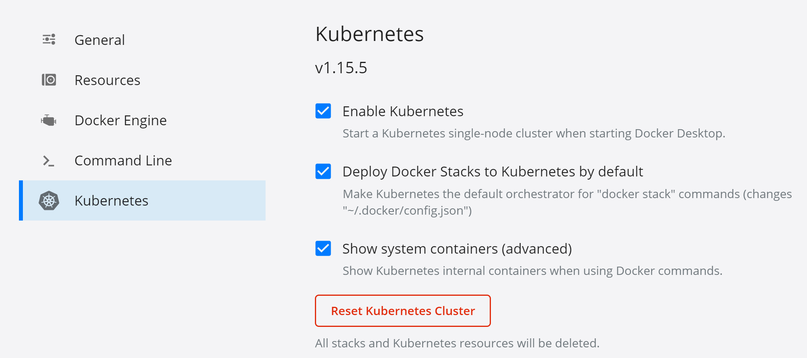
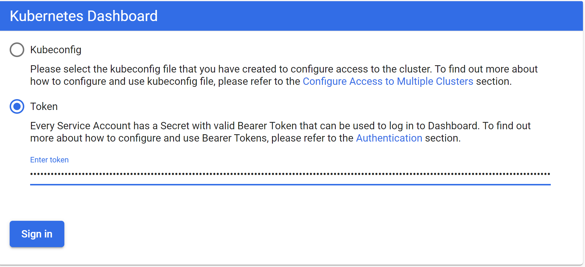
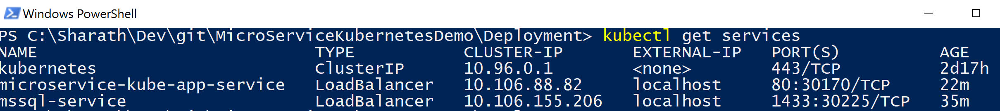

# Microservice Kubernetes Demo
A simple Asp.Net Core API project with EF Core and Sql server, running on Kubernetes (AWS EKS / local Docker desktop environment)

This demo uses the same application which was used to demonstrate an ASP.NET application running on Docker container locally. Please refer it to quickly spin up an app in your local Docker environment without Kubernetes - https://github.com/sharathgopinath/microservice-demo

*Kubernetes basics: https://kubernetes.io/docs/tutorials/kubernetes-basics/*

## Prerequisites to run Kubernetes locally on Docker Desktop (Linux containers on Windows)
- Ensure you have Docker desktop installed (https://www.docker.com/products/docker-desktop)
- Switch to **Linux** containers from the Docker taskbar icon (If you see the option "Switch to Windows containers", that means it's already set to Linux containers so skip this step)
- Enable Kubernetes in Docker desktop

- Ensure your kubernetes context is set to docker desktop (to run it locally). Click on the Docker taskbar icon, hover over "kubernetes" menu item and select "Docker desktop". You will see the AWS context once that is setup, more on that later.
- If everything's fine, run the kubectl version command and it should display the kubernetes version information
```
> kubectl version
```
- Setup the Kubernetes dashboard. Follow the steps provided on https://kubernetes.io/docs/tasks/access-application-cluster/web-ui-dashboard/ to set it up. You can stop at the "Welcome View" step for now to keep it short, more details on deploying containerized application is provided below
- The Kubernetes dashboard will ask you to login. Run the below command to get the admin bearer token, copy the token and paste it on the login screen to login
```
> kubectl -n kubernetes-dashboard describe secret $(kubectl -n kubernetes-dashboard get secret | sls admin-user | ForEach-Object { $_ -Split '\s+' } | Select -First 1)
```


## Prerequisites to run Kubernetes on AWS EKS (Elastic Kubernetes Service)
EKS is a fully managed Kubernetes service provided by AWS. At the time of writing this Readme, EKS with AWS Fargate is not yet available in my region (Sydney, i.e., ap-southeast-2) so I'm going with EKS with Linux clusters which uses EC2 instances to deploy the worker nodes. (Fargate is a serverless compute for containers).

1. Follow the steps provided here - https://docs.aws.amazon.com/eks/latest/userguide/getting-started-eksctl.html to do the below two things. **Do not create clusters and node groups yet, I have explained those steps below**
- Install AWS CLI and configure your AWS CLI Credentials
- Install eksctl (command line utility for EKS)

2. Create a key-pair using Amazon EC2 (if you already have one which you would like to use, you can skip this step). Goto https://console.aws.amazon.com/ec2/, in the navigation pane choose key pairs, then create key pair. Select ppk if you are on a Windows system and use PuTTY for ssh. Note down your key pair name (minus the extension).
3. Create a cluster. Run the below command which creates a new cluster called  "test", in the ap-southeast-2 region, EC2 instance type is t3.medium and max nodes is 2.  **Once you create a cluster using the below command, AWS will provision a number of resources (VPC subnets, NAT, IAM roles, security groups, EC2 instances etc). Some of them are not free, especially the EC2 instances, so it's a good idea to tear down all the resources once you're done with it, more on that later.**
```
> eksctl create cluster --name test --region ap-southeast-2 --nodegroup-name standard-workers --node-type t3.medium --nodes 2 --nodes-min 1 --nodes-max 2 --ssh-access --ssh-public-key ec2-keypair --managed
```
It takes about 10 mins to create all those resources, once done you will see a "successfully created message". You can also see the status on the AWS console cloud formation page. It essentially creates two CF stacks, one for the cluster and one for the nodegroup (http://console.aws.amazon.com/cloudformation). Once done, Run the below command and you should the kubernetes service running - 
```
> kubectl get svc
```

If you run into any problems until this point, please do refer the official documentation provided above (https://docs.aws.amazon.com/eks/latest/userguide/getting-started-eksctl.html), just ensure you run the command provided in this readme for creating the cluster to be able to run the project and to keep the costs down :wink:
4. Setup the Kubernetes web dashboard (this step is optional, but recommended). Follow the steps provided here - https://docs.aws.amazon.com/eks/latest/userguide/dashboard-tutorial.html
5. If you went ahead with the setup of Kuberentes web dashboard and are using Powershell, use the below command to get the admin bearer token to login to the dashboard - 
```
> kubectl -n kube-system describe secret $(kubectl -n kube-system get secret | sls eks-admin-token | ForEach-Object { $_ -Split '\s+' } | Select -First 1)
```


## Deployment
Deployment to Kubernetes is defined in .yaml files. There are a couple of yaml files in the Deployment folder of this project which will be used to deploy the application. Each container has to be deployed and exposed as a service, in this case we have two containers
- Container - 1: ASP.NET Core API application
- Container - 2: SQL Server database

While deploying a database, it is best practice to mount it to a persistent volume. A persistent volume, as the name suggests is to persist the data. If we do not specify volume in the mssql deployment yaml file, the database will use the node's local file storage to store the data which will be lost in case the node hosting the database goes down or crashes for some reason. In our example, we will use the persistent volume when deploying to AWS, but for deploying locally, we will go with a simple approach and not specify any persistent volume.

### Deploy to local Kubernetes environment
All deployment scripts are in the Deployment folder.
- Run the below command to apply the Config maps, we define our database connection string in the config map. I have defined the credentials as well here, but there are better approaches to store it . (refer https://kubernetes.io/docs/concepts/configuration/secret/)
```
> kubectl apply -f mssql-config-map.yaml
```
1. Run the below command to deploy mssql. Here we use the mcr.microsoft.com/mssql/server:2019-latest docker image for sql server
```
> kubectl apply -f mssql-deployment-local.yaml
```
You can check if the mssql-service is running withe below command, alternatively you can check the status of all services on the web dashboard
```
> kubectl get services
```


You can also login to the mssql-service from your SQL management studio, use the password defined in the config map. Username will be - localhost,1433

2. Deploy the API container
To do this, first you need to create the container and push it to Docker Hub. Create a Docker Hub account if you do not already have an account (https://hub.docker.com/). In our local Kubernetes deployment, we will use our API app container from Docker registry. For the AWS deployment, we will push the container to the AWS ECR (Elastic Container Registry).

- Build the docker container using Docker compose. Navigate to the project's root directory which contains docker-compose.yml (The steps to build is similar to the ones demonstrated at - https://github.com/sharathgopinath/microservice-demo)
```
> docker-compose build
> docker login  # may prompt for username and password, login with your docker hub credentials
> docker push <YOUR_DOCKERHUB_USERNAME>/microservice-kube-app
```

Once the microservice-kube-app container is pushed successfully, you will have to use that container name (<YOUR_DOCKERHUB_USERNAME/microservice-kube-app) in the app-deployment.yaml file. Replace the container name in the yaml file with your newly pushed container name
```
containers:
        - image: "<YOUR_DOCKERHUB_USERNAME/microservice-kube-app"
```
- Run the below command to deploy to Kubernetes local (navigate to Deployment folder)
```
> kubectl apply -f app-deployment.yaml
```
You can check if the app service is running by the kubectl get services command


3. Your application should be up and running! It should be available on http://localhost/api/Product

